# Loan Calculator App

A SwiftUI-based loan calculator application with dark and light theme support, built using MVVM clean architecture and SOLID principles.

[](https://www.apple.com/ios/)
[](https://swift.org)
[](LICENSE)

## **Demo 🎥**
https://github.com/user-attachments/assets/be01acf2-d599-42e4-92b2-9d246cbe473c

## Screenshots

### Loans List & Empty State

<table>
  <tr>
    <td colspan="2" align="center"><b>Loans List</b></td>
    <td colspan="2" align="center"><b>Loans List - Empty</b></td>
  </tr>
  <tr>
    <td><b>Light</b></td>
    <td><b>Dark</b></td>
    <td><b>Light</b></td>
    <td><b>Dark</b></td>
  </tr>
  <tr>
    <td>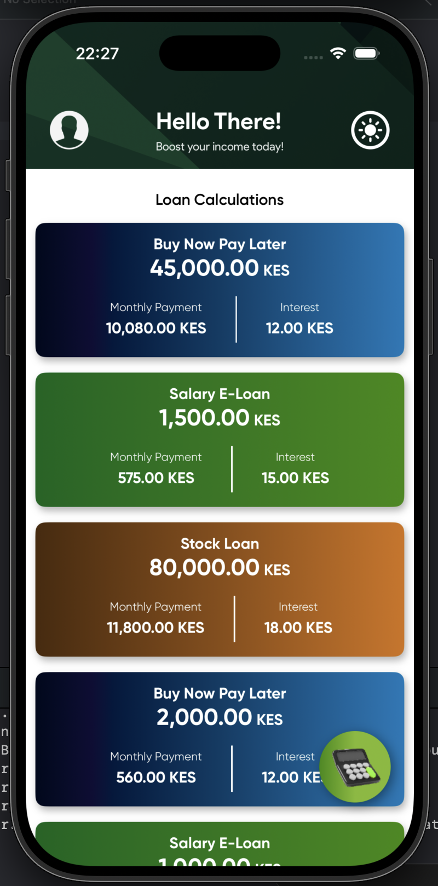</td>
    <td>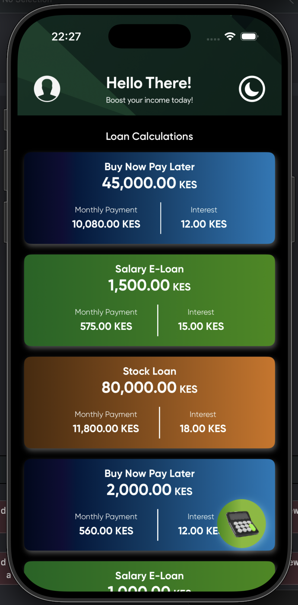</td>
    <td>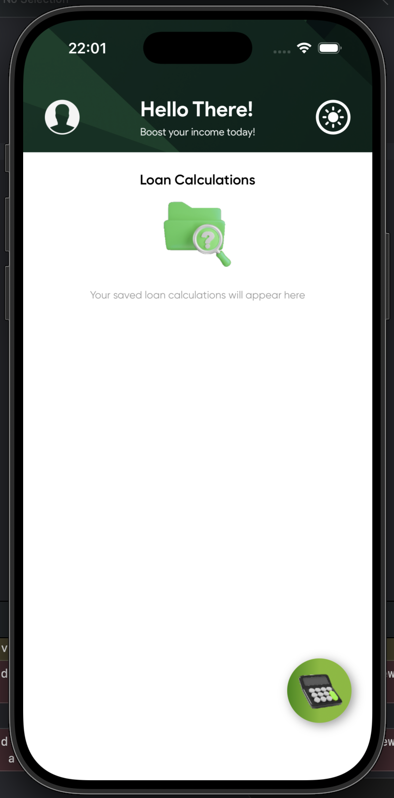</td>
    <td>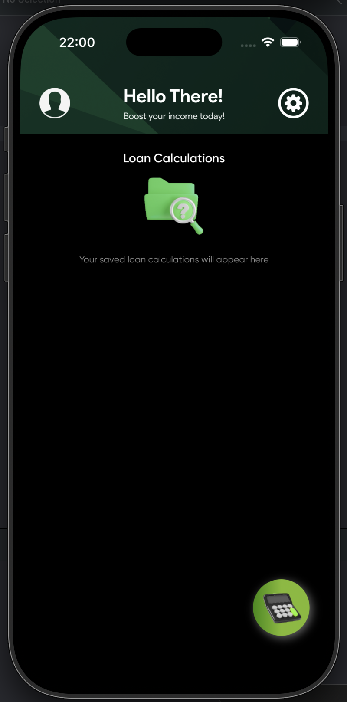</td>
  </tr>
</table>

### Theme Selection & Calculate Loan

<table>
  <tr>
    <td colspan="2" align="center"><b>Change Theme</b></td>
    <td colspan="2" align="center"><b>Calculate Loan - Empty</b></td>
  </tr>
  <tr>
    <td><b>Light</b></td>
    <td><b>Dark</b></td>
    <td><b>Light</b></td>
    <td><b>Dark</b></td>
  </tr>
  <tr>
    <td>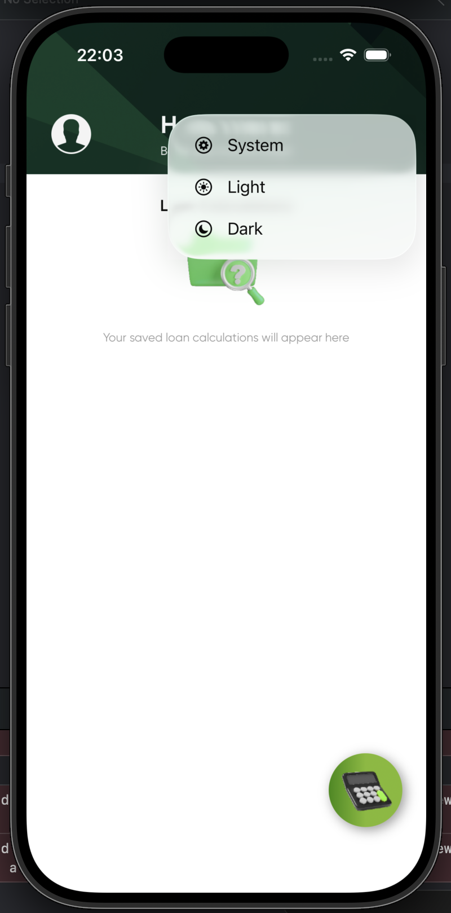</td>
    <td>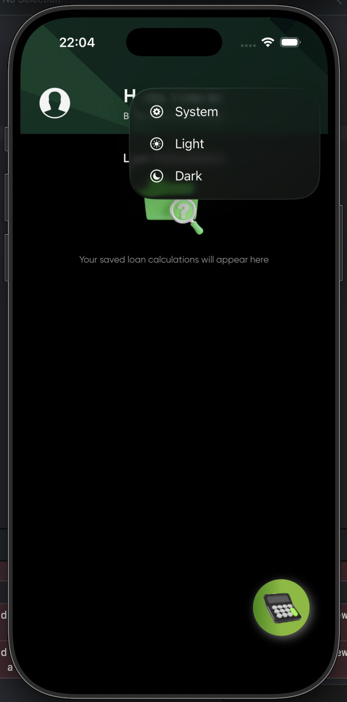</td>
    <td>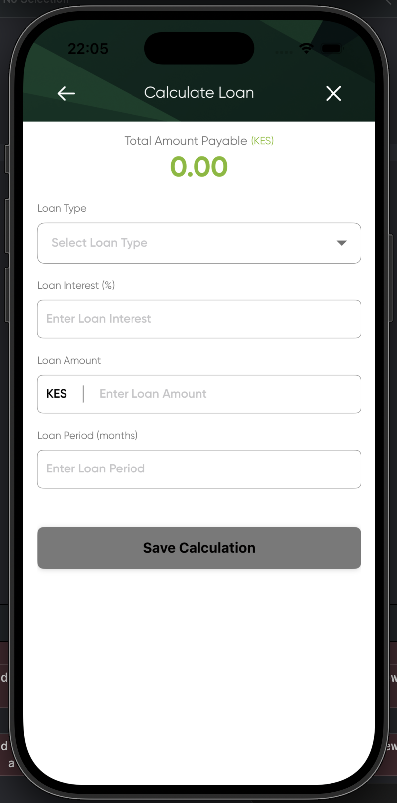</td>
    <td>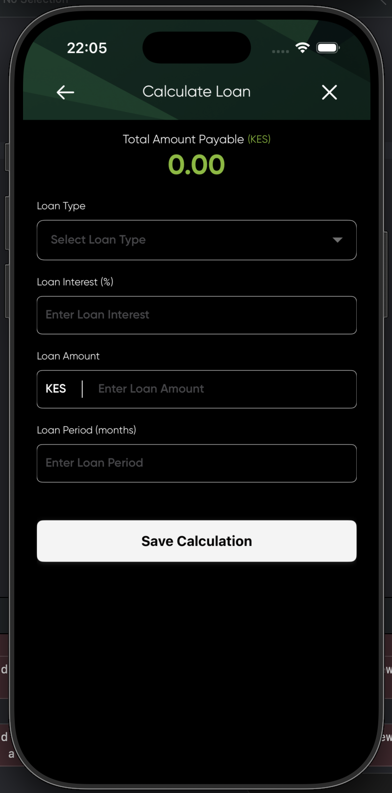</td>
  </tr>
</table>

### Loan Type Selection & Loan Calculation

<table>
  <tr>
    <td colspan="2" align="center"><b>Loan Type Bottom Sheet</b></td>
    <td colspan="2" align="center"><b>Calculate Loan</b></td>
  </tr>
  <tr>
    <td><b>Light</b></td>
    <td><b>Dark</b></td>
    <td><b>Light</b></td>
    <td><b>Dark</b></td>
  </tr>
  <tr>
    <td>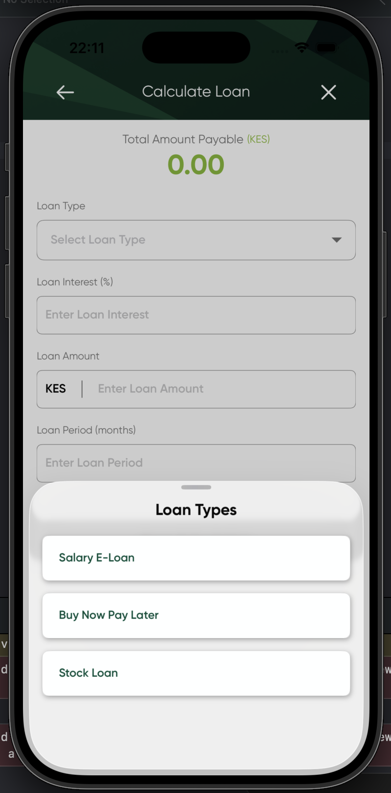</td>
    <td>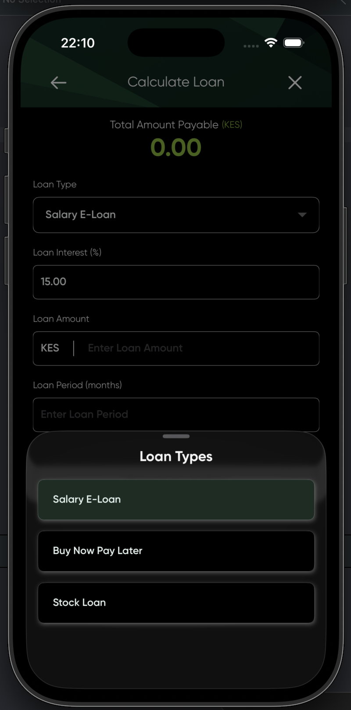</td>
    <td>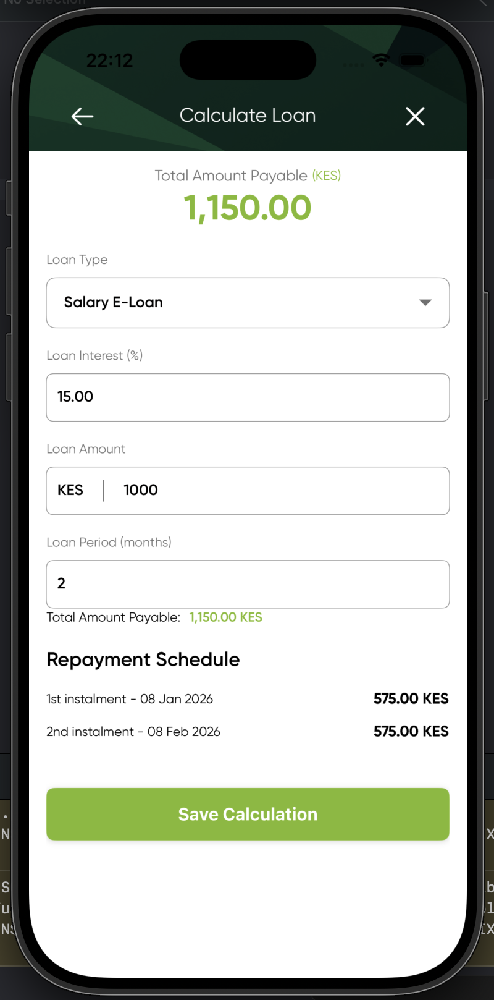</td>
    <td>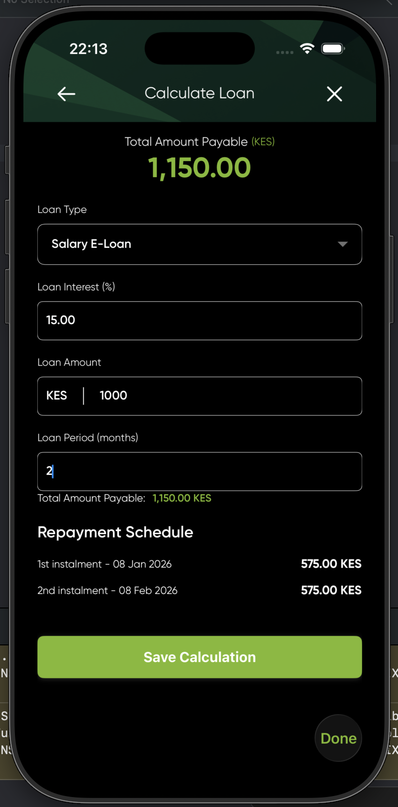</td>
  </tr>
</table>

### Calculation Saved & Loan Details

<table>
  <tr>
    <td colspan="2" align="center"><b>Calculation Saved Dialog</b></td>
    <td colspan="2" align="center"><b>Loan Details</b></td>
  </tr>
  <tr>
    <td><b>Light</b></td>
    <td><b>Dark</b></td>
    <td><b>Light</b></td>
    <td><b>Dark</b></td>
  </tr>
  <tr>
    <td>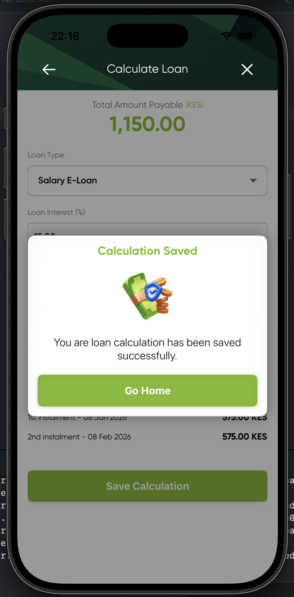</td>
    <td>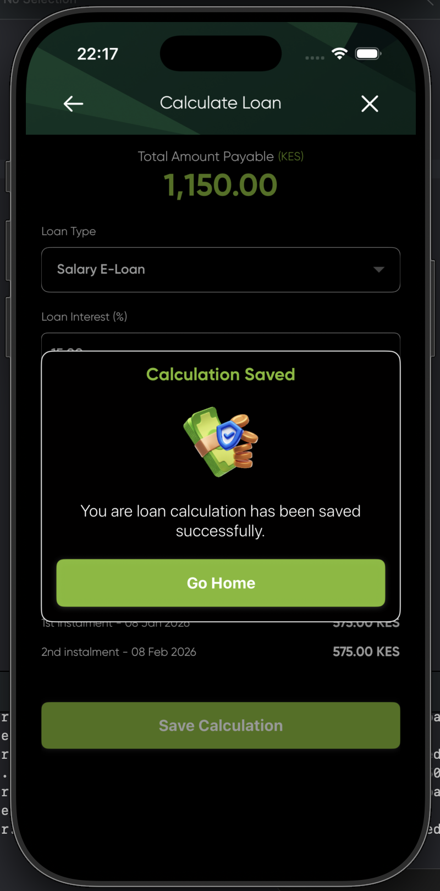</td>
    <td>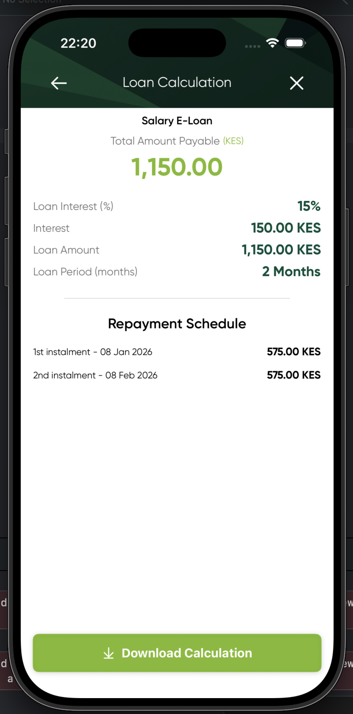</td>
    <td>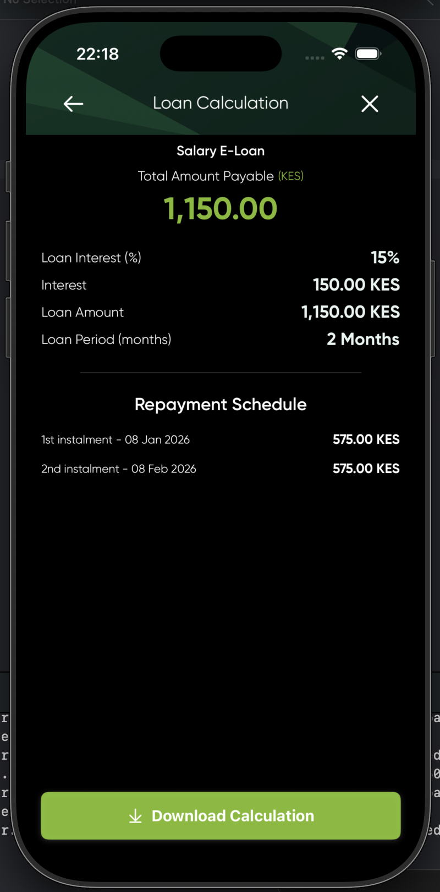</td>
  </tr>
</table>

### Download PDF

<table>
  <tr>
    <td colspan="2" align="center"><b>Download PDF</b></td>
    <td colspan="2" align="center"><b>Downloaded PDF Details</b></td>
  </tr>
  <tr>
    <td><b>Light</b></td>
    <td><b>Dark</b></td>
    <td><b>Light</b></td>
    <td><b>Dark</b></td>
  </tr>
  <tr>
    <td>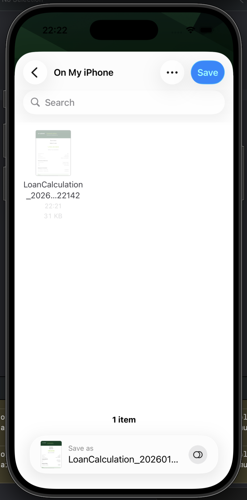</td>
    <td>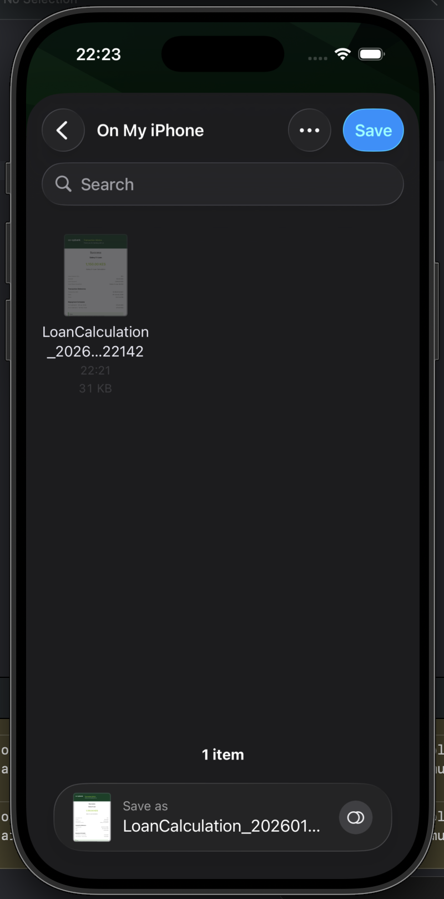</td>
    <td>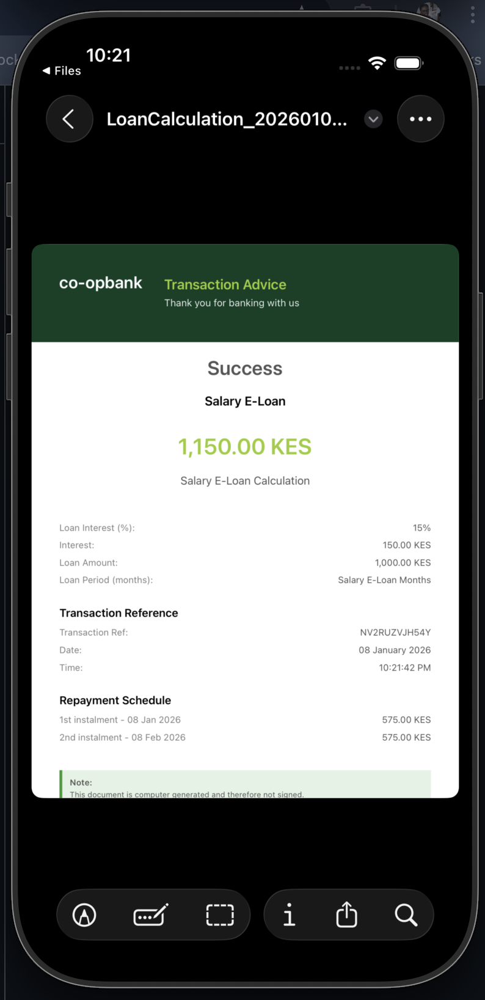</td>
    <td>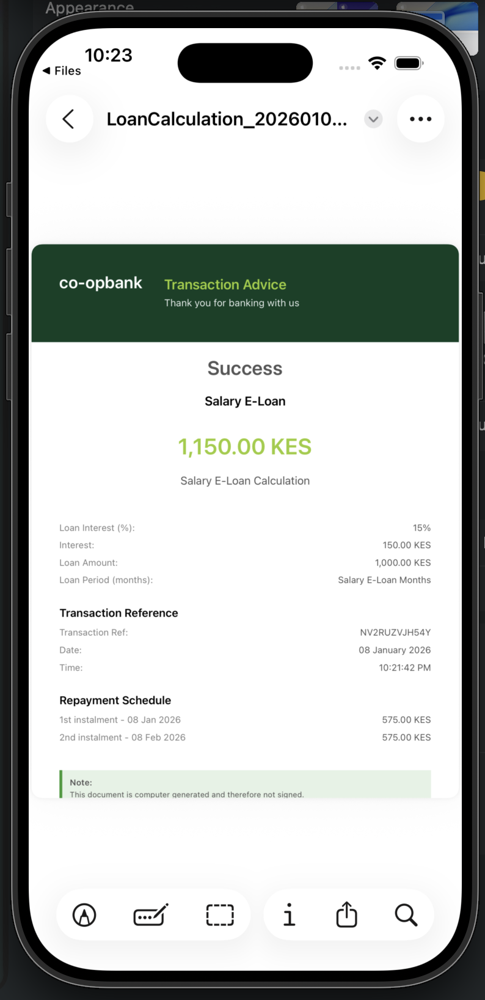</td>
  </tr>
</table>

## Features

- Native SwiftUI interface
- Dark and Light theme support
- Multiple loan types (Salary E-Loan, Buy Now Pay Later, Stock Loan)
- Detailed loan calculations with repayment schedules
- PDF export functionality with document picker
- Save and view loan calculations locally
- Comprehensive unit and UI tests
- Automated CI/CD with GitHub Actions

## Architecture

This project follows **MVVM (Model-View-ViewModel)** clean architecture with **SOLID principles**:

### MVVM Structure
- **Models**: Data structures (`Loan`, `LoanTypeOption`, `RepaymentInstalment`)
- **ViewModels**: Business logic and state management (`ThemeViewModel`, `LoanViewModel`)
- **Views**: SwiftUI views (`CalculateLoanView`, `LoanDetailsView`, `LoansListView`)

### SOLID Principles
- **Single Responsibility**: Each class has one clear purpose
- **Open/Closed**: Components are open for extension but closed for modification
- **Liskov Substitution**: Protocols and abstractions used throughout
- **Interface Segregation**: Focused, minimal interfaces
- **Dependency Inversion**: High-level modules don't depend on low-level modules

### Data Persistence
- **UserDefaults**: Local storage for loan calculations and user preferences
- **Reactive Updates**: `@Published` properties for automatic UI updates
- **Data Models**: Codable structs for easy serialization

### PDF Generation
- **UIGraphicsPDFRenderer**: Native PDF generation
- **Document Picker**: iOS native file picker for save location
- **Professional Formatting**: Bank receipt-style layout with branding

## Testing

### Unit Tests (XCTest)
- ViewModel logic testing
- Calculation accuracy verification
- Data persistence validation
- Mock data testing

### UI Tests (XCUITest)
- User flow automation
- Screen navigation testing
- Form input validation
- PDF export verification

### Continuous Integration
Automated testing runs on every push and pull request via **GitHub Actions**:

**Workflow includes:**
- ✅ Build verification
- ✅ Unit test execution
- ✅ UI test execution  
- ✅ Code coverage reporting
- ✅ Linting and code quality checks

**Sample GitHub Actions workflow:**
```yaml
name: CI

on:
  push:
    branches: [ main, develop ]
  pull_request:
    branches: [ main, develop ]

jobs:
  test:
    runs-on: macos-latest
    steps:
      - uses: actions/checkout@v3
      - name: Build and Test
        run: |
          xcodebuild test \
            -scheme YourSchemeName \
            -destination 'platform=iOS Simulator,name=iPhone 14' \
            -enableCodeCoverage YES
```

## Requirements

- iOS 15.0+
- Xcode 13.0+
- Swift 5.5+

## Installation

1. Clone the repository
```bash
git clone https://github.com/martin-ngigi/Calculator.git
cd Calculator
```

2. Open the `.xcodeproj` file in Xcode
3. Build and run the project

### Running Tests

**Unit Tests:**
```bash
# Command line
xcodebuild test -scheme Calculator -destination 'platform=iOS Simulator,name=iPhone 16'

# Or in Xcode
⌘ + U
```

**UI Tests:**
```bash
# Command line
xcodebuild test -scheme Calculator -destination 'platform=iOS Simulator,name=iPhone 16' -only-testing:Calculator

# Or in Xcode
⌘ + U (runs all tests)
```

## Project Structure

```
LoanCalculatorApp/
├── Core/
│   ├── Components/
│   │   ├── Buttons/
│   │   ├── Color/
│   │   ├── Corners/
│   │   ├── Dialogs/
│   │   ├── InputFeild/
│   │   ├── Modifiers/
│   │   ├── Toasts/
│   │   ├── ToolBar/
│   ├── Extensions/
│   ├── Models/
│   ├── Utils/
├── Features/
│   ├── Loans/
│   │   ├── Data/
│   │   │   ├── Datasource/
│   │   │   ├── Repositories/
│   │   │   ├── Models/
│   │   ├── Domain/
│   │   │   ├── Entites/
│   │   │   ├── Repositories/
│   │   │   ├── Usecases/
│   │   ├── Presentation/
│   │   │   ├── Views/
│   │   │   ├── ViewModels/
│   ├── Themes/
│   │   ├── Data/
│   │   │   ├── Datasource/
│   │   │   ├── Repositories/
│   │   │   ├── Models/
│   │   ├── Domain/
│   │   │   ├── Entites/
│   │   │   ├── Repositories/
│   │   │   ├── Usecases/
│   │   ├── Presentation/
│   │   │   ├── Views/
│   │   │   ├── ViewModels/
├── Tests/
│   ├── LoanCalculatorTests/
│   └── LoanCalculatorUITests/
└── screenshots/
    └── screenshots/
```

## Usage

1. **Launch the app** - View the loans list or start a new calculation
2. **Create Calculation:**
   - Tap the floating calculator button
   - Select loan type from dropdown (auto-populates interest rate)
   - Enter loan amount
   - Choose loan period in months
   - View real-time calculation updates
3. **View Repayment Schedule** - See monthly instalments with due dates
4. **Save Calculation** - Tap "Save Calculation" to persist locally
5. **Download PDF:**
   - Tap "Download Calculation"
   - Choose save location via document picker
   - Professional bank receipt-style PDF generated
6. **View Saved Loans** - Access previous calculations from the main list
7. **Theme Toggle** - Switch between light and dark modes

## Technical Highlights

### UserDefaults Persistence
```swift
// Save loan calculation
UserDefaults.standard.set(encodedData, forKey: "savedLoans")

// Retrieve saved calculations
if let data = UserDefaults.standard.data(forKey: "savedLoans") {
    let loans = try JSONDecoder().decode([Loan].self, from: data)
}
```

### Reactive ViewModel
```swift
class LoanCalculatorViewModel: ObservableObject {
    @Published var selectedLoanType: LoanTypeOption
    @Published var totalAmountPayable: Double = 0.0
    @Published var repaymentSchedule: [RepaymentInstalment] = []
    
    func calculateLoan() {
        // Calculation logic with automatic UI updates
    }
}
```


---

Made with ❤️ by Martin